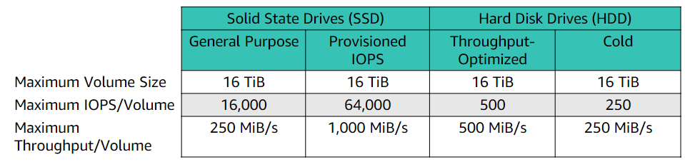

# Module 7

## Section 1: Amazon Elastic Block Store (Amazon EBS)

### Storage

- provides persistent (retains data after power off ~ non-volatile) block storage volumes for use w Amazon EC2 instances.
- each volume automatically replicated within its availability zone to protect from component failure.
- designed for high availability and durability
- provide consistent & low-latency performance
- scale usage up or down in mins

### AWS storage options: Block vs object storage

- What if you want to change 1 character in 1-GB file?

Block storage

- change only block that contains e character

Object storage

- entire file updated
- critical difference btwn some storage types is whether they offer block-level or object-level
    - major effect on throughput, latency, and cost of storage
    - block typically faster & use less bandwidth but more $$

### Amazon EBS

- enables you to create individual storage volumes & attach to EC2 instances
- offers block-level storage
- volumes automatically replicated within its availability zone
- can be backed up automatically to S3 through snapshots (a backup of a volume)
- provides durable, detachable, block-level storage (similar to hard drive)
- low latency as directly attached to instances
- Uses:
    - Boot volumes and storage for Amazon EC2 instances
    - Data storage with a file system
    - Database hosts
    - Enterprise applications

### Volume Types

- Only SSDs can be used as boot volumes for EC2
- Lower cost options might be for additional storage or other use cases

### Volume Type Use Cases

| Solid State Drives (SSD) | Hard Disk Drives (HDD) |
| --- | --- |

| General Purpose | Provisioned IOPS | Throughput-Optimized | Cold |
| --- | --- | --- | --- |
| This type is recommended for most workloads | Critical business applications that require sustained IOPS performance, or more than 16,000 IOPs or 250 MiB/s of throughput per volume | Streaming workloads that require consistent, fast throughput at a low price | Throughput-oriented storage for large volumes of data that is infrequently accessed |
| System boot volumes | Large database workloads | Big data | Scenarios where the lowest storage cost is important |
| Virtual desktops |  | Data warehouses | It cannot be a boot volumeLow-latency interactive applications |
|  |  | Log processing |  |
| Development and test environments |  | It cannot be a boot volume |  |

### Amazon EBS features

- Snapshots
    - point-in-time snapshots
    - recreate a new volume at any time
- Encryption
    - Encrypted EBS volumes
    - No additional cost
- Elasticity (change any time without stopping instance)
    - Increase capacity
    - Change to different types

### Amazon EBS: Volumes, IOPS, and Pricing

1. Volumes
    - Persist independently from instance
    - All volume types are charged by amount provisioned per month
2. IOPS
    - General Purpose SSD:
        - Charged by amount provision in GB per month until storage is released
    - Magnetic
        - Charged by no. of requests to volume
    - Provisioned IOPS SSD:
        - Charged by amount you provision in IOPS (multiplied by % of days you provision for the month)
3. Snapshots
    - Added cost of EBS snapshots to S3 is per GB/month of data stored
4. Data transfer
    - Inbound data transfer is free
    - Outbound data transfer across Region incurs charges.

## Section 2: Amazon Simple Storage Service (Amazon S3)

### Storage

- object-level storage
- data stored as objects within resources called buckets
- virtually unlimited storage
- Designed for 11 9s of durability
- Granular access to bucket and objects

### Amazon S3 storage classes

- Amazon S3 Standard
    - designed for high durability, availability, and performance object storage for frequently accessed data
    - low latency, high throughput
    - use cases i.e. cloud applications, dynamic websites, content distributions
- Amazon S3 Intelligent-Tiering
    - optimize costs by automatically moving data to the most cost-effective tier, w/o performance impact/operational overhead
    - monitors access patterns of objects and moves object to infrequent tier if not accessed for 30 days
- Amazon S3 Standard-Infrequent Access (Amazon S3 Standard-IA)
    - used for data accessed less frequently, but requires rapid access when needed
    - high durability, high throughput, and low latency
    - good for long-term storage & backups and data storage for disaster recovery
- Amazon S3 One Zone-Infrequent Access (Amazon S3 One Zone-IA)
    - similar to Standard-IA, but instead of minimum 3 availability zones, can store data in one zone
    - cheaper than Standard-IA
- Amazon S3 Glacier
    - secure, durable, and low-cost storage class for data archiving
    - 3 retrieval options ranging from few mins to hrs
- Amazon S3 Glacier Deep Archive
    - lowest-cost storage price
    - long term retention and digital preservation for data accessed roughly 1-2 times a year.

### Amazon S3 bucket URLs (two styles)

- https://s3.ap-northeast-1.amazonaws.com/bucket-name
- https://bucket-name.s3-ap-northeast-1.amazonaws.com

### Data is redundantly stored in the Region

- durably store your data, even if there is concurrent data loss in two AWS facilities.

### Designed for seamless scaling

- automatically manages the storage behind your bucket while data grows
- scales to handle a high volume of requests

### Access data anywhere

- AWS Management Console
- AWS Command Line Interface
- SDK

### Common use case

- Storing application assets
- Static web hosting
- Backup and disaster recovery (DR)
- Staging area for big data

### Amazon S3 common scenarios

- Backup and storage
    - Provide data backup and storage services for others
- Application hosting
    - Provide services that deploy , install, and manage web apps
- Media hosting
    - Build a redundant, scalable, and highly available infrastructure that hosts video, photo, or music uploads and downloads.
- Software delivery
    - Host your software applications that customers can download

### Amazon S3 pricing

- Pay for what you use
    - GBs per month
    - Transfer OUT to other Regions
    - PUT, COPY, POST, LIST, and GET requests
- Do not pay for
    - Transfer IN S3
    - Transfers out in same region

### Storage price factors

- Storage class type
    - Standard storage is designed for:
        - 11 9s of durability
        - Four 9s of availability
    - S3 S-IA:
        - 11 9s
        - Three 9s of “ “
- Amount of storage
    - number and size of objects
- Requests
    - number & type of requests (GET,PUT,COPY)
    - GET needs READ access
    - PUT needs WRITE access
    - COPY needs both
- Data transfer
    - Pricing based on amount of data being transferred out of AWS

## Section 3: Amazon Elastic File System (Amazon EFS)

- simple, scalable, elastic file storage for use w AWS services and on-premises resources.

### Features

- Petabyte scaling
- Multiple EC2's can access a EFS at a time
- No minimum fee or setup costs, pay for the storage you use
- Supports NFS 4.0 and 4.1
- Compatible with all Linux-based AMIs for EC2
- Encryption optional
- Low latency

### Use cases

- Big data analytics
- Media processing workflows
- Home directories

### Architecture

### EFS implementation

- Create EC2 resources and launch your Amazon EC2 instance
- Create EFS file system
- Create mount targets in appropriate subnets
- Connect EC2 instances to mount targets
- Verify resources and protection of AWS account

### EFS resources

File system - primary resource with properties such as

- ID
- Creation token
- Creation time
- File system size in bytes
- Number of mount targets that are created for file system
- File system state

Primary resources can be configured with supporting resources like

- Mount Target
    - ID
    - Subnet ID for subnet it was created in
    - File system ID for the file system where it was created
    - IP address where file system can be mounted
    - Mount target set
- Tags
    - Help organize file system
    - Assign meta data to each file system
    - Key-Value Pair

## Section 4: Amazon S3 Glacier

- Data archiving service designed for security,durability, & extremely low cost
- Designed to provide 11 9s of durability for objects
- Supports encryption of data in transit & at rest via Secure Sockets Layer (SSL) or Transport Layer Security (TLS)
- Vault Lock feature enforces compliance through policy

### 3 key terms

- Archive
    - Any object (i.e. photo,video,file,doc) stored in S3 Glacier.
    - Base unit of storage in Glacier
    - Each archive has Unique ID
    - and can also have description
- Vault
    - container for storing archives
    - when vault is created, specify vault name and region
- Vault access policy
    - Determine who can/cannot access data stored in vault,
    - and what operations users can/cannot perform
    - vault lock policy makes sure vault cant be altered
    - each value can only have 1 access policy and lock policy

### 3 options for retrieving data

- Expedited retrievals
    - made available within 1-5mins (highest cost)
- Standard retrievals
    - complete within 3-5 hours
- Bulk retrievals
    - take 5-12 hours (lowest cost)

### Use Cases

- Media asset archiving
- Healthcare information archiving
- Regulatory and compliance archiving
- Scientific data archiving
- Digital preservation

### How to access

- Management console (limited to certain instructions)
- REST APIs, AWS Java or .NET SDKs, or CLI (all operations)

### Lifecycle policies

- Enable you to delete or move objects based on age

### Storage comparison

